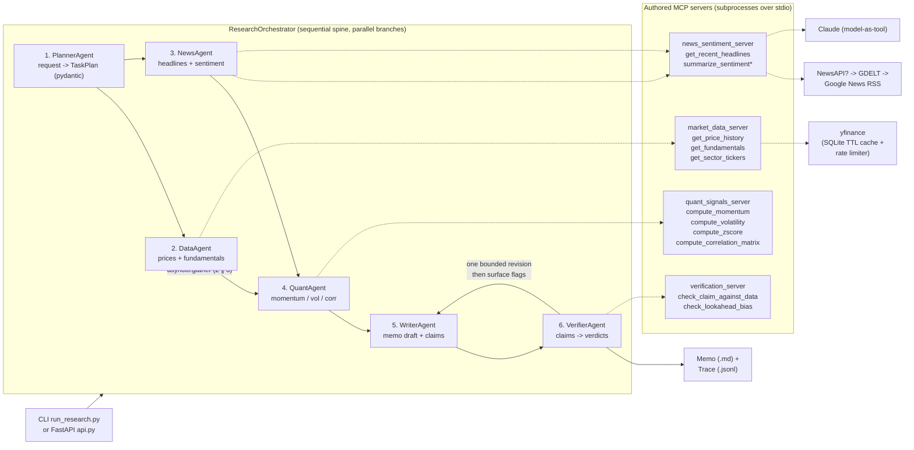

# Market Research Agents — multi-agent research memos over authored MCP servers

Type a request like *"analyze semiconductor sector momentum"* and a team of
specialized agents collaborates over **MCP (Model Context Protocol)** to
produce a structured, source-cited research memo — with every numeric claim
verified against the underlying tool data **before** you see it.

> **For educational and research purposes only.** Not investment advice, not a
> recommendation, and not for use in making trading decisions. See
> [Limitations & Non-Goals](#limitations--non-goals).

## Architecture



\* `summarize_sentiment` embeds a Claude call **inside the MCP tool** — one
agent's tool invoking the model as a subroutine ("model-as-a-tool" pattern,
documented in `mcp_servers/sentiment.py`). The verification server is the
opposite choice, deliberately: it is **deterministic and unit-tested**, because
an LLM verifier would just be another opinion.

### Design principles

- **No fabrication, ever.** Every data layer returns an explicit `no_data`
  envelope when a source has nothing; the memo shows honest gaps.
- **Calibrated language.** Claims carry sample sizes ("positive but weak
  (0.05, n=30 days)"); certainty words are flagged by the verifier.
- **Verifiability.** Every tool call (agent, server, tool, args, result,
  timestamp, duration) is appended to `data/traces/<run_id>.jsonl` — an
  explainability artifact you can diff against the memo.
- **MCP server authoring.** The four servers are real FastMCP-style servers
  the orchestrator spawns as subprocesses and speaks MCP stdio to.
- **Graceful offline mode.** Without `ANTHROPIC_API_KEY` the pipeline still
  runs end-to-end on deterministic, clearly-labeled fallbacks (planner
  heuristics, template memo, lexicon sentiment) so the system is testable
  without secrets.

## Setup (clean machine)

Requirements: Python 3.11+ and [uv](https://docs.astral.sh/uv/) (or pip).

```bash
# 1. Clone and enter
git clone https://github.com/YKI-KMI/JASON market-research-agents
cd market-research-agents

# 2. Install (uv creates .venv and locks deps from pyproject.toml/uv.lock)
uv sync

# 3. Configure environment (optional — see .env.example)
cp .env.example .env
#    set ANTHROPIC_API_KEY=sk-ant-...   for full Claude mode
#    (without it, everything still runs in labeled offline mode)

# 4. Run the test suite
uv run pytest -v
```

pip alternative: `pip install -r requirements.txt`.

## Usage

```bash
# Full pipeline, live data, MCP servers as subprocesses (default):
python run_research.py "analyze semiconductor sector momentum"

# Explicit tickers + window:
python run_research.py "compare momentum and volatility for NVDA and AMD over 60 days"

# Machine-readable summary:
python run_research.py "analyze semiconductor sector momentum" --json
```

Outputs:
- `output/memo_<run_id>.md` — the research memo (executive summary, data
  table, key findings with `[metric]` citations, data gaps, risks, and a
  verification report section).
- `data/traces/<run_id>.jsonl` — one JSON object per line: every agent step
  and tool call with args, results, and durations.

### Web API

```bash
uv run uvicorn api:app --reload
# then:
curl -s -X POST localhost:8000/research \
  -H 'content-type: application/json' \
  -d '{"request": "analyze semiconductor sector momentum"}'
```

## Example run (abridged)

```markdown
# Research memo: analyze semiconductor sector momentum

## Data table
| Metric | Value | n | Window (days) |
|---|---|---|---|
| NVDA_momentum | 0.1823 | 90 | 90 |
| AMD_momentum | -0.0431 | 90 | 90 |

## Key findings
- NVDA momentum over the 90-day window is positive but moderate (0.1823, n=90 days).
- AMD momentum over the 90-day window is negative but weak (-0.0431, n=90 days).

## Verification report
- 4/4 claim(s) verified against the supporting tool data.
```

(Actual values depend on the day's data — that's the point: they're computed,
not canned. Every number in a real memo appears verbatim in the run's trace.)

## Repo layout

```
mcp_servers/        the four authored MCP servers (+ pure logic siblings)
  signals.py            pure numpy/pandas math (unit-tested against hand-computed values)
  market_data.py        yfinance client: cache, rate limit, no-data envelopes
  news_client.py        NewsAPI -> GDELT -> RSS chain, verbatim headlines only
  sentiment.py          Claude-as-tool sentiment with labeled offline fallback
  verification.py       deterministic claim checking + lookahead bias
agents/             planner, workers, quant, writer, verifier, orchestrator, schemas
core/               config, SQLite TTL cache, rate limiter, trace, model seam, MCP client
tests/              100+ pytest cases incl. math, schemas, e2e with mocked sources
run_research.py     CLI entrypoint
api.py              FastAPI layer
```

## Limitations & Non-Goals

**This is not a trading system.**
- No order execution, no broker connectivity, no live position management.
- Outputs are descriptive research summaries and must not be used as
  investment advice or trading signals.

**Data caveats.**
- Yahoo Finance data may be delayed, adjusted retroactively, or unavailable;
  there are **no real-time data guarantees**.
- News coverage (GDELT / Google News RSS) is a sample of coverage, not a
  census; sentiment scoring in offline mode is a transparent toy lexicon.
- The sector map is a curated static sample of representative tickers, not an
  index membership list.

**Method caveats.**
- Momentum/volatility are simple descriptive statistics over one window; no
  transaction costs, liquidity, capacity, or turnover modeling.
- Small samples produce noisy estimates — which is exactly why the verifier
  flags certainty language and the memo prints sample sizes.
- The deterministic verifier catches numeric/directional grounding errors; it
  cannot judge subtle economic reasoning (a model-based review is layered on
  top in Claude mode, but model reviews are opinions too).

**Engineering caveats.**
- v1 orchestrates a fixed pipeline; it is not a general graph framework.
- Claude mode quality depends on the model; JSON outputs are schema-validated
  with one repair retry, then the pipeline degrades to labeled fallbacks.
